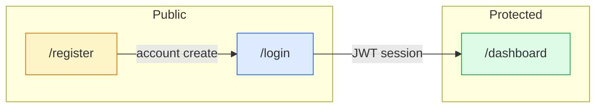

# 🔐 Auth Notes — KaizenHub Portfolio

> Portfolio project-এর authentication system সম্পর্কে সম্পূর্ণ বাংলা documentation।  
> Login, Register, Middleware, NextAuth — সব এক জায়গায়।

---

## 📚 Table of Contents

| # | File | বিষয় |
|---|------|--------|
| 1 | [auth-overview.md](./auth-overview.md) | পুরো auth system — big picture |
| 2 | [loginpage.md](./loginpage.md) | Login page বিস্তারিত |
| 3 | [registerpage.md](./registerpage.md) | Register page বিস্তারিত |

---

## 🗂️ Related Files (Codebase)

```
app/(auth)/
├── layout.tsx          ← shared auth wrapper (logo, glass card)
├── login/page.tsx      ← sign in form
└── register/page.tsx   ← create account form

auth.ts                 ← NextAuth config + authorize()
auth.config.ts          ← middleware-এর lightweight config
middleware.ts           ← route protection
lib/
├── actions/index.ts    ← registerUser() server action
├── validations/schemas.ts  ← loginSchema, registerSchema
└── db/models/User.ts   ← MongoDB user + bcrypt hash
```

---

## ⚡ Quick Reference

| Action | Entry Point | Backend | Success Redirect |
|--------|-------------|---------|------------------|
| **Login** | `signIn("credentials")` | `auth.ts → authorize()` | `/dashboard` |
| **Register** | `registerUser()` | Server Action → `User.create()` | `/login?registered=1` |

---

## 🔗 Flow at a Glance



---

*Last updated: June 2026*
