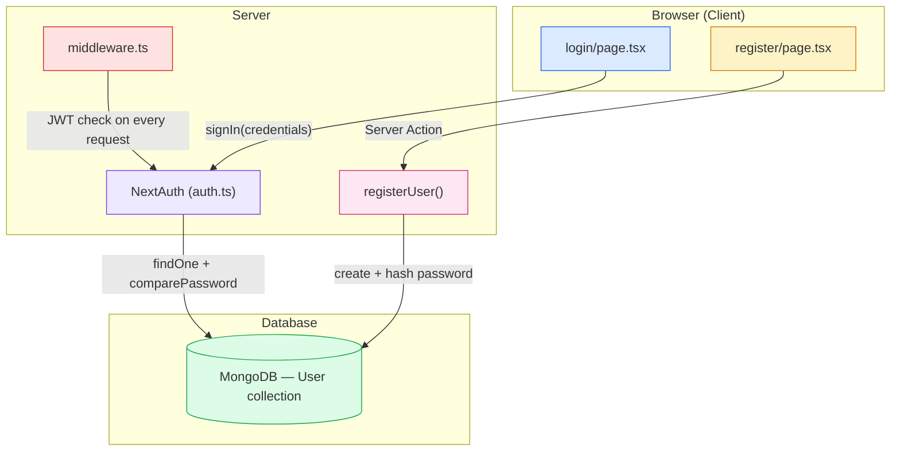
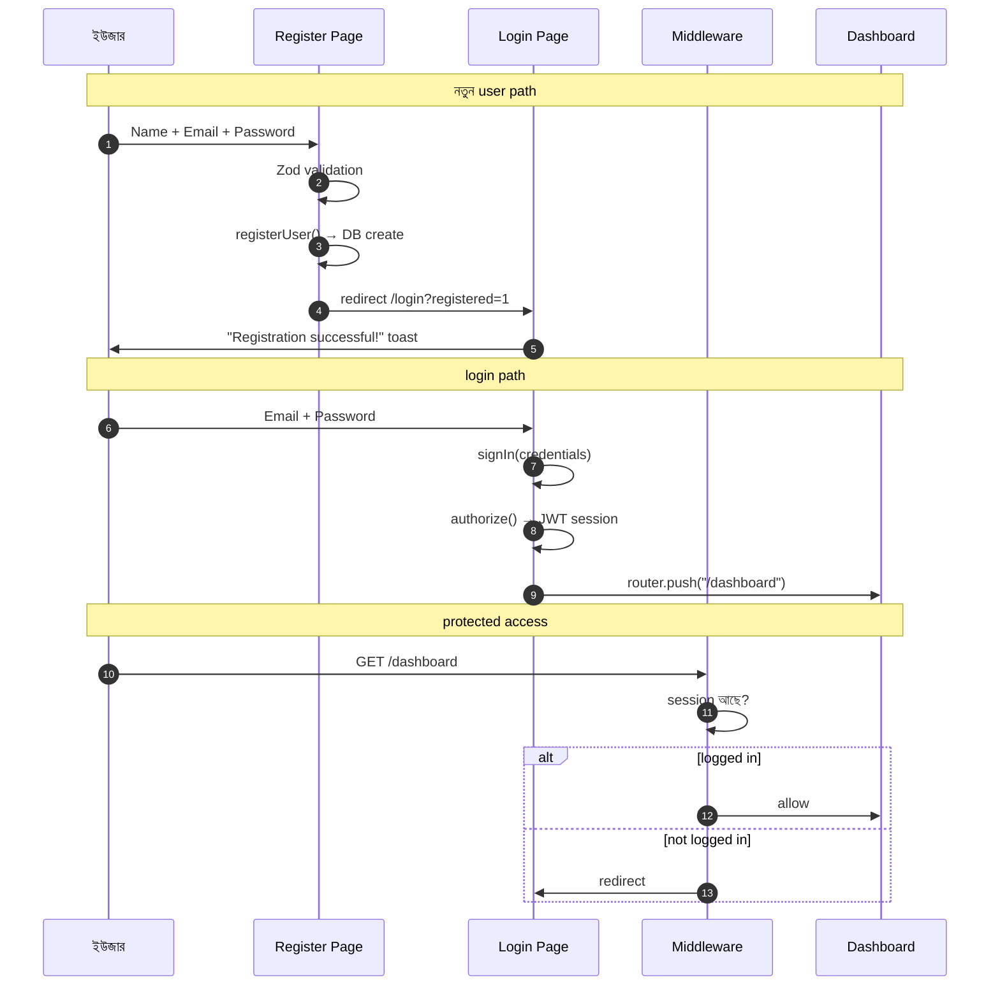
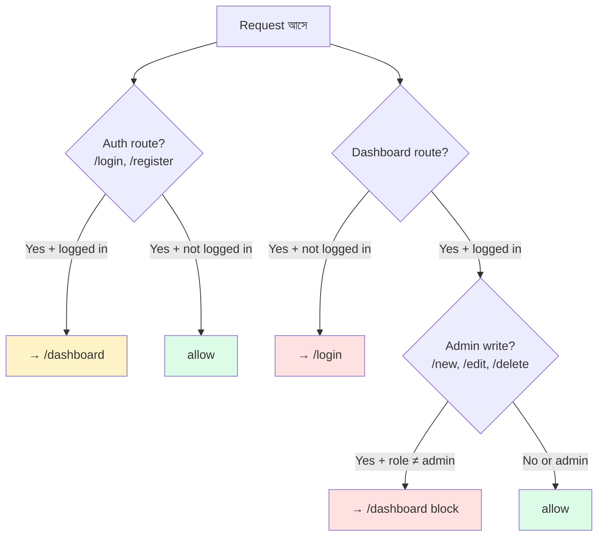
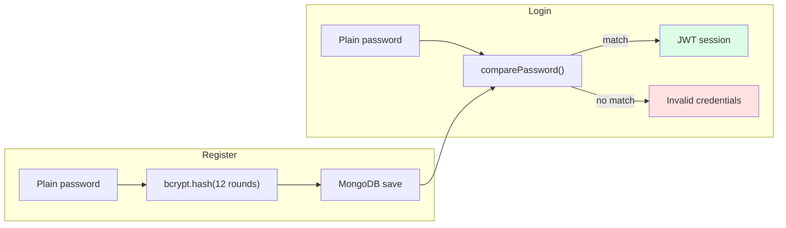

# Auth System — Big Picture

> Login + Register + Middleware + NextAuth — কীভাবে একসাথে কাজ করে।

---

## 🏗️ Architecture



---

## 📁 File Structure

```
/register URL
/login URL
    │
    └── app/(auth)/layout.tsx     ← route group (URL-এ দেখা যায় না)
            ├── register/page.tsx
            └── login/page.tsx
```

| File | Role |
|------|------|
| `(auth)/layout.tsx` | Shared UI — background, logo, glass card |
| `login/page.tsx` | Sign in UI + NextAuth call |
| `register/page.tsx` | Sign up UI + Server Action call |
| `auth.ts` | Credentials provider, JWT, authorize() |
| `middleware.ts` | Protect `/dashboard`, block non-admin writes |
| `User.ts` | Schema, bcrypt hash on save, comparePassword |

---

## 🔄 Complete User Journey



---

## ⚖️ Login vs Register

| | Login | Register |
|---|--------|----------|
| **উদ্দেশ্য** | আগের account verify | নতুন account create |
| **API** | `signIn("credentials")` | `registerUser()` Server Action |
| **Password rule** | min 8 characters | min 8 + upper + lower + number |
| **Session** | JWT তৈরি হয় (30 days) | Session তৈরি হয় না |
| **Success redirect** | `/dashboard` | `/login?registered=1` |
| **Role** | DB থেকে আসে | সবসময় `"user"` |

---

## 🛡️ Middleware Rules



| Condition | Result |
|-----------|--------|
| Logged in + `/login` or `/register` | → `/dashboard` |
| Not logged in + `/dashboard` | → `/login` |
| `user` role + `/new`, `/edit`, `/delete` | → block, dashboard |
| `admin` role | full access |

---

## 🔑 Password Security Flow



> Password **কখনো** plain text DB-তে save হয় না — `User.pre("save")` hook hash করে।

---

## 📖 Deep Dive Links

- [Login Page Notes →](./loginpage.md)
- [Register Page Notes →](./registerpage.md)
