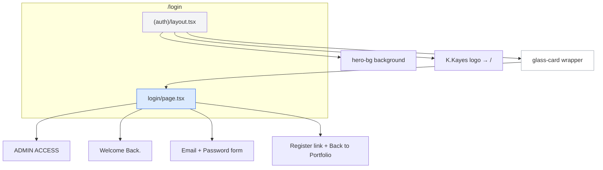
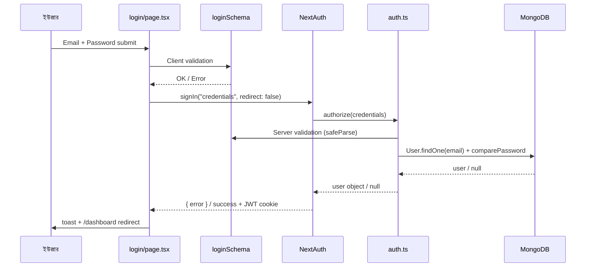
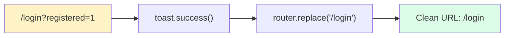
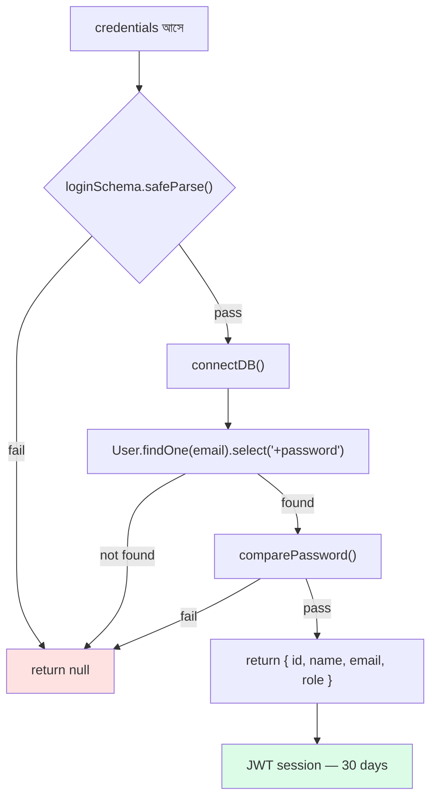

# Login Page — সম্পূর্ণ ব্যাখ্যা

> **File:** `app/(auth)/login/page.tsx`  
> **URL:** `/login`  
> **উদ্দেশ্য:** Email + Password দিয়ে sign in → JWT session → dashboard access

← [Overview](./auth-overview.md) | [Register Notes →](./registerpage.md)

---

## 📐 Page Structure



`(auth)` = **route group** — URL-এ দেখা যায় না, শুধু login/register shared layout-এ রাখে।

---

## 🔄 Login Flow (Sequence Diagram)



---

## 🧩 Component Breakdown

### 1. `"use client"` — কেন?

Next.js App Router-এ default = **Server Component**।  
Login page-এ লাগে:

| Hook / Feature | কাজ |
|----------------|-----|
| `useState` | Loading spinner |
| `useRouter` | Dashboard redirect |
| `useSearchParams` | `?registered=1` detect |
| `handleSubmit` | Form events |

→ তাই `"use client"` directive বাধ্যতামূলক।

---

### 2. Registration Success Toast

```tsx
// Register সফল হলে: /login?registered=1
useEffect(() => {
  if (searchParams.get("registered") === "1") {
    toast.success("Registration successful! Please sign in.");
    router.replace("/login"); // URL clean — query param সরানো
  }
}, [searchParams, router]);
```



---

### 3. Form Validation

**Stack:** `react-hook-form` + `zodResolver` + `loginSchema`

| Piece | Role |
|-------|------|
| `loginSchema` | email valid + password min 8 |
| `zodResolver` | Submit-এর আগে validate |
| `register("email")` | Input ↔ form state bind |
| `errors.email` | Red border + error message |
| `noValidate` | Browser default validation off |

**Schema (`lib/validations/schemas.ts`):**

```
email    → valid email format
password → minimum ৮ characters
```

> Register-এ password strict (upper+lower+number) — login-এ শুধু min 8, যাতে পুরনো account-ও login করতে পারে।

---

### 4. Submit — `onSubmit`

```tsx
const result = await signIn("credentials", {
  email: data.email.trim(),
  password: data.password,
  redirect: false,  // manual redirect — toast দেখানোর জন্য
});
```

| Option | কেন |
|--------|-----|
| `"credentials"` | `auth.ts`-এ define করা provider |
| `redirect: false` | NextAuth auto redirect বন্ধ — আমরা control করি |

**Outcome:**

| Result | Action |
|--------|--------|
| `result.error` | `toast.error("Invalid email or password")` |
| Success | `toast.success` → `router.push("/dashboard")` → `router.refresh()` |

---

### 5. UI Elements

| Element | Purpose |
|---------|---------|
| `ADMIN ACCESS` | Section label |
| `Welcome Back.` | Heading |
| Email input | `autoComplete="email"`, `aria-*` |
| Password input | `autoComplete="current-password"` |
| Submit button | Loading: disabled + spinner |
| Register link | → `/register` |
| Back to Portfolio | → `/` |

---

## ⚙️ Backend — `auth.ts`

Login page `signIn()` call করলে **`authorize()`** চলে:



| Step | Detail |
|------|--------|
| Server Zod validation | Client bypass হলেও safe |
| `+password` | Password field `select: false` — explicitly fetch |
| bcrypt compare | Plain vs hashed |
| JWT | `maxAge: 30 * 24 * 60 * 60` (30 days) |
| Return | id, name, email, role — **password never returned** |

---

## 🛡️ Middleware Protection

Login page শুধু sign in করে — **dashboard guard middleware করে**।

| Condition | Redirect |
|-----------|----------|
| Logged in + `/login` | → `/dashboard` |
| Not logged in + `/dashboard` | → `/login` |
| `user` + admin write URLs | → block |
| `admin` | full access |

→ বিস্তারিত: [auth-overview.md](./auth-overview.md#-middleware-rules)

---

## 📂 Files with Bengali Comments

| File | Content |
|------|---------|
| `app/(auth)/login/page.tsx` | Full page |
| `app/(auth)/layout.tsx` | Shared wrapper |
| `auth.ts` | NextAuth + authorize |
| `middleware.ts` | Route protection |
| `lib/validations/schemas.ts` | loginSchema |

---

## 💡 One-Line Summary

```
Login Page  = UI + validation + signIn()
auth.ts     = DB verify + JWT session
middleware  = dashboard guard + admin check
layout      = shared auth design
```
