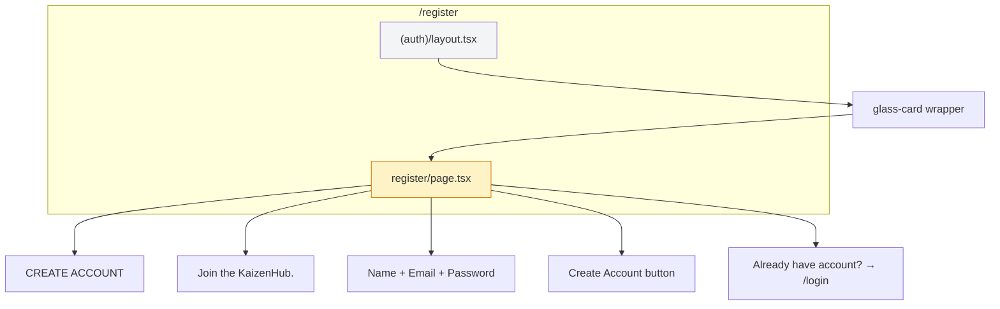
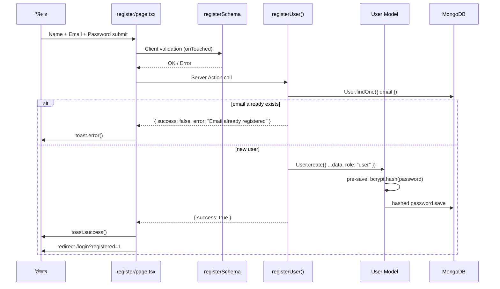
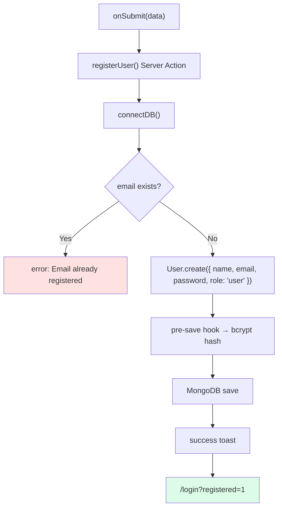
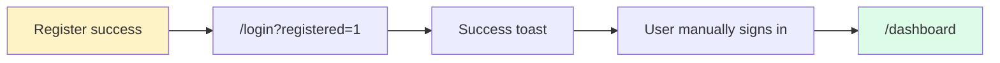
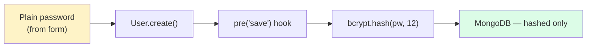
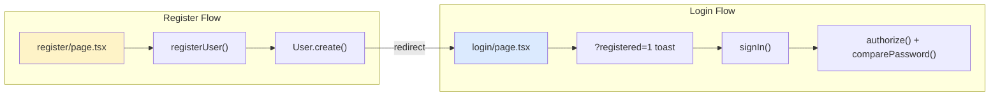

# Register Page — সম্পূর্ণ ব্যাখ্যা

> **File:** `app/(auth)/register/page.tsx`  
> **URL:** `/register`  
> **উদ্দেশ্য:** নতুন account create → login page-এ redirect (auto login নয়)

← [Overview](./auth-overview.md) | [Login Notes →](./loginpage.md)

---

## 📐 Page Structure



Login-এর মতো same layout — কিন্তু **logic সম্পূর্ণ আলাদা** (Server Action, NextAuth নয়)।

---

## 🔄 Register Flow (Sequence Diagram)



---

## ⚖️ Login vs Register

| | Login | Register |
|---|--------|----------|
| **কাজ** | Account verify | Account create |
| **API** | `signIn("credentials")` | `registerUser()` Server Action |
| **Validation mode** | onSubmit (default) | `onTouched` |
| **Password rule** | min 8 char | min 8 + upper + lower + number |
| **Session** | JWT তৈরি | Session তৈরি হয় **না** |
| **Success redirect** | `/dashboard` | `/login?registered=1` |
| **Default role** | DB থেকে | `"user"` (hardcoded) |

---

## 🧩 Component Breakdown

### 1. Form Validation — `mode: "onTouched"`

```tsx
useForm<RegisterInput>({
  resolver: zodResolver(registerSchema),
  mode: "onTouched",  // ফিল্ড touch-এর পর validation
});
```

| Mode | Behavior |
|------|----------|
| Login (default) | Submit-এ validate |
| Register (`onTouched`) | Blur/touch-এ validate — typing চলাকালীন কম annoyance |

---

### 2. Form Fields

| Field | Validation Rule |
|-------|-----------------|
| **name** | min 2, max 60 characters |
| **email** | valid email format |
| **password** | min 8 + `a-z` + `A-Z` + `0-9` |

**Password regex:**

```regex
^(?=.*[a-z])(?=.*[A-Z])(?=.*\d)
```

---

### 3. Submit — `registerUser(data)`



**Login-এর মতো NextAuth ব্যবহার হয় না** — এটা pure Server Action:

```tsx
const result = await registerUser(data);

if (!result.success) {
  toast.error(result.error ?? "Registration failed");
  return;
}

toast.success("Account created successfully!");
router.push("/login?registered=1");
router.refresh();
```

---

### 4. কেন Login-এ Redirect? (Auto Login নয়)



| Reason | Explanation |
|--------|-------------|
| Security | Explicit credential entry after account create |
| UX clarity | User knows account created, then signs in |
| Separation | Register = create, Login = authenticate |

Login page `useEffect` দিয়ে `?registered=1` detect করে toast দেখায়।

---

## ⚙️ Backend Details

### `registerUser()` — `lib/actions/index.ts`

| Step | Code Logic |
|------|------------|
| 1 | `connectDB()` |
| 2 | Dynamic import `User` model (bundle optimize) |
| 3 | `User.findOne({ email })` — duplicate check |
| 4 | `User.create({ ...data, role: "user" })` |
| 5 | Return `{ success: true/false }` |

> **Admin role** register form দিয়ে তৈরি হয় না — manually DB/seed দিয়ে set করা হয়।

---

### Password Hash — `lib/db/models/User.ts`



| Feature | Detail |
|---------|--------|
| `select: false` | Default query-তে password hidden |
| `pre("save")` | Save-এর আগে auto hash |
| `comparePassword()` | Login-এ plain vs hash match |
| Salt rounds | 12 |

---

## 🛡️ Middleware

| Condition | Result |
|-----------|--------|
| Not logged in + `/register` | ✅ Allow (public) |
| Logged in + `/register` | → `/dashboard` redirect |

→ Register public, কিন্তু already logged in user register page access করতে পারে না।

---

## 📂 Files with Bengali Comments

| File | Content |
|------|---------|
| `app/(auth)/register/page.tsx` | Full page |
| `lib/validations/schemas.ts` | registerSchema |
| `lib/actions/index.ts` | registerUser() |
| `lib/db/models/User.ts` | hash + comparePassword |

---

## 🔗 Register → Login Connection



---

## 💡 One-Line Summary

```
Register = validate → server action → duplicate check → DB create (hashed pw) → login redirect
Login    = separate step → NextAuth JWT session → dashboard
```
